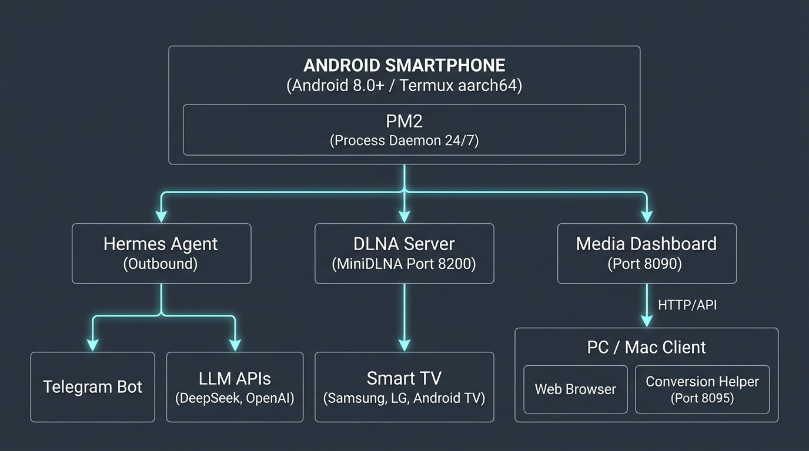
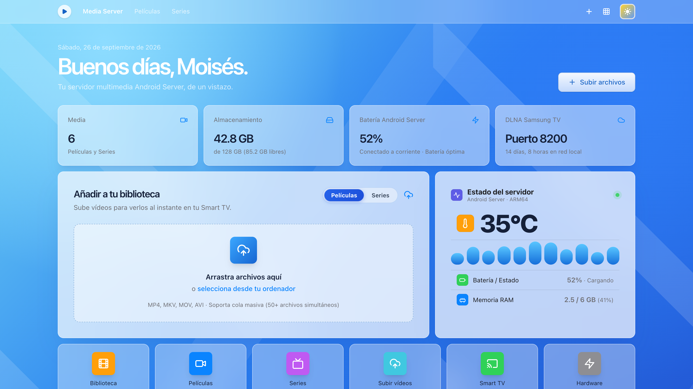

<div align="center">

# 📱 Android Home Server
### Convierte cualquier smartphone Android en un servidor doméstico 24/7 con IA autónoma, streaming multimedia y automatización por crons
### *Turn any Android smartphone into a 24/7 home server with autonomous AI, media streaming & cron automation*

[](https://github.com/moisesvalero/android-home-server/stargazers)
[](https://github.com/moisesvalero/android-home-server/network/members)
[](LICENSE)
[](https://f-droid.org)
[](https://www.python.org/)
[](https://nodejs.org/)
[](https://core.telegram.org/bots)
[]()
[]()
[](AGENTS.md)

<br />

<p align="center">
  
</p>

<p align="center">
  🌐 <b>Idiomas / Languages:</b> <a href="#-español">🇪🇸 Español</a> • <a href="#-english">🇬🇧 English</a> • <a href="AGENTS.md">🤖 AI Agents Guide</a>
</p>

</div>

---

<h2 id="-español">🇪🇸 Español</h2>

### 🌟 ¿Qué es Android Home Server?

**Android Home Server** es una suite completa y de código abierto para transformar un smartphone Android en un servidor doméstico continuo, seguro y de bajísimo consumo (1 a 3 vatios), sin necesidad de rootear el terminal y operando sobre **Termux**.

Sustituye por completo las costosas instancias VPS en la nube y supera ampliamente a una Raspberry Pi básica, integrando en un solo dispositivo:

1. 🤖 **Agente de Inteligencia Artificial 24/7 (Hermes Agent):** Asistente autónomo accesible desde Telegram mediante *outbound long-polling*, compatible con cualquier LLM (DeepSeek, OpenAI, Groq, OpenRouter o modelos locales vía Ollama).
2. 📺 **Servidor Multimedia DLNA + Web Dashboard:** Streaming directo de películas y series a tu Smart TV (Samsung Tizen, LG webOS, Google TV/Android TV) con **0% CPU y ~17 MB de RAM**, junto a un panel web interactivo en el puerto `8090` con diseño estilo macOS/VisionOS y telemetría en vivo.
3. ⏰ **Crons Automatizados Inteligentes:** Rastreo de ofertas de empleo con memoria anti-duplicados (`seen_jobs.json`), radar de chollos tecnológicos y resumen diario de noticias.
4. 🔋 **Cuidado de Batería (Estrategia del 50%):** Arquitectura de seguridad física y por software que mantiene el litio a su voltaje de reposo (~3.8V) evitando la degradación e hinchazón.
5. 📢 **Megafonía Física TTS Doméstica:** Utiliza los altavoces físicos del teléfono como intercomunicador remoto por Telegram (`/di <mensaje>`) a volumen 15/15 con latencia instantánea y 0 tokens consumidos.

---

### ⚡ Comparativa: Smartphone Android vs Raspberry Pi 4 vs VPS en la Nube

| Característica | VPS Básica (AWS / GCP / Hetzner) | Raspberry Pi 4 (4 GB) | Smartphone Android (6 GB RAM) |
| :--- | :--- | :--- | :--- |
| **Memoria RAM** | 1 GB *(Cuelgues por falta de memoria OOM)* | 4 GB LPDDR4 | **6 GB – 8 GB LPDDR4X** (~3+ GB libres) |
| **Procesador** | 0.25 – 1 vCPU compartida con throttling | 4 núcleos Cortex-A72 | **8 núcleos físicos ARM64** |
| **Almacenamiento**| Disco virtual en red / HDD lento | MicroSD lenta (fácil corrupción) | **Memoria Flash UFS** ultrarrápida |
| **Protección Eléctrica** | N/A ante cortes de luz | Se apaga en seco (corrupción de DB) | **Batería integrada = SAI / UPS nativo** |
| **Coste** | 5 € - 10 € al mes (60-120 €/año) | 80 € - 110 € con accesorios | **0 € (Hardware amortizado en casa)** |
| **Consumo Eléctrico**| Facturado externamente | ~5W a 8W | **~1W a 3W (prácticamente cero)** |

---

### 🔋 Cuidado y Seguridad de la Batería: La Estrategia del 50%

> [!IMPORTANT]
> **Nunca dejes una batería de iones de litio conectada al cargador al 100% las 24 horas del día.** La tensión continua sobre la celda degrada el electrolito y provoca hinchazón física con el tiempo.

Para garantizar máxima longevidad y seguridad contra sobrecalentamiento:

1. **Voltaje de Reposo Electroquímico:** A ~3.8V por celda (entre el 45% y el 65% de carga), el litio no sufre tensión química destructiva.
2. **Temporizador de Enchufe:** Un programador mecánico de 4 € activa el cargador únicamente **30 a 45 minutos dos veces al día** (ej. 08:00–08:45 y 20:00–20:45). El resto de la jornada el móvil opera con su batería interna.
3. **Watchdog Térmico en Python (`cron_battery_guard.py`):** Consulta `termux-battery-status` cada 30 minutos:
   * **Batería < 25%:** Emite alerta urgente por Telegram si falló el enchufe o se desconectó el cable.
   * **Temperatura ≥ 45°C:** Alerta crítica inmediata para retirar el cargador o mejorar la ventilación.

### 🤖 ¿Prefieres que un Agente de IA lo monte por ti?

> [!TIP]
> **No tienes que hacer todo el proceso a mano si no te apetece.**
> Puedes clonar este repositorio o pasarle el enlace a tu agente de IA preferido (**Claude Code, Cursor, Windsurf, Antigravity, OpenCode, Codex, Copilot...**) y decirle directamente:
> 
> ```text
> "Quiero montar este servidor doméstico en mi móvil Android siguiendo las instrucciones de este repositorio. Léete AGENTS.md y haz todo el trabajo o guíame paso a paso."
> ```
> 
> El agente leerá las instrucciones completas en [**`AGENTS.md`**](AGENTS.md), detectará si puede conectarse por **SSH** o **ADB** para hacerlo de forma 100% autónoma, o te pedirá únicamente tus claves de Telegram y LLM facilitándote los comandos exactos para dejar el servidor funcionando sin esfuerzo.

---

### 🚀 Instalación Rápida en 3 Pasos (Manual)

#### 1. Prepara Termux en el móvil Android
1. Instala **Termux** y **Termux:API** desde [F-Droid](https://f-droid.org) (evita Google Play).
2. En los ajustes de Android, desactiva la optimización de batería para Termux (*Ajustes → Aplicaciones → Termux → Batería → "Sin restricciones"*).

#### 2. Clona el repositorio y configura variables
Abre Termux y ejecuta:

```bash
pkg update -y && pkg install -y git
git clone https://github.com/moisesvalero/android-home-server.git ~/.hermes-server
cd ~/.hermes-server

# Copia la plantilla y rellena tus claves
cp .env.example .env
nano .env
```

#### 3. Ejecuta el instalador automático
```bash
chmod +x install.sh
./install.sh
```

El script configurará automáticamente dependencias nativas C/Rust, Python 3, Node.js, MiniDLNA y registrará los procesos en **PM2** con auto-arranque en `~/.termux/boot/start-services.sh`.

---

### 🎬 Servidor Multimedia DLNA & Web Dashboard (`:8090`)

<p align="center">
  
</p>

Abre desde el navegador de tu ordenador o tablet en la misma red Wi-Fi:

👉 **`http://<IP-DE-TU-MOVIL>:8090`**

* **Bento Telemetry Card:** Muestra en vivo la temperatura del procesador con código de color, pulso del sistema, nivel de batería, memoria RAM y gigas libres de flash UFS.
* **Cola de Subidas Drag & Drop:** Suelta vídeos con subida concurrente y streaming a disco por bloques de 64 KB con limpieza de parciales si se interrumpe la red.
* **Carátulas HD Automáticas (`fetch_cover.py`):** Rastrea las APIs de IMDb y TVMaze para asociar el póster oficial en alta definición a cada título.
* **Streaming a la Smart TV:** Pulsa **Fuentes** (o *Dispositivos Conectados*) en el mando de tu televisión y selecciona **Android Media Server**.
* **El "Botón Mágico" (Conversión sin saturar el móvil):** Si tu televisor rechaza archivos `.avi` antiguos de DivX/Xvid, un micro-asistente silencioso en tu PC/Mac (`media_server/mac_helper.py` o `enviar_al_servidor.sh`) convierte el archivo con `ffmpeg` nativo por hardware en 1 clic y lo transfiere al servidor ya optimizado.

---

### 🤖 Proveedores LLM y Crons Soportados

Configura en tu archivo `.env` el proveedor de lenguaje que prefieras:

```bash
DEFAULT_LLM_PROVIDER="deepseek"       # deepseek | openai | groq | openrouter | ollama
DEFAULT_LLM_MODEL="deepseek-flash"
```

* **DeepSeek:** `deepseek-flash`, `deepseek-chat` (económico, rápido y excelente en español).
* **OpenAI:** `gpt-4o`, `gpt-4o-mini`.
* **Groq:** Inferencia ultrarrápida en milisegundos con `llama-3.3-70b-versatile`.
* **OpenRouter:** Acceso unificado a cientos de modelos comerciales y abiertos.
* **Ollama / Local:** Modelos locales en tu PC en la red local (`http://192.168.1.X:11434/v1`).

---

### 🛠️ Comandos de Gestión (PM2)

```bash
# Ver estado, memoria y CPU en vivo
pm2 status

# Ver logs en tiempo real
pm2 logs hermes           # Logs del agente de IA
pm2 logs media-dashboard  # Logs de subidas y panel web
pm2 logs dlna-server      # Logs del servidor DLNA

# Reiniciar todos los servicios
pm2 restart all

# Guardar lista activa para auto-arranque tras reinicio
pm2 save
```

---

<br />

---

<h2 id="-english">🇬🇧 English</h2>

### 🌟 What is Android Home Server?

**Android Home Server** is a complete, open-source stack designed to transform any Android smartphone into a continuous, secure, and ultra-low-power (1 to 3 Watts) 24/7 home server using **Termux (no root required)**.

It replaces expensive cloud VPS instances and easily outperforms a standard Raspberry Pi by integrating into a single device:

1. 🤖 **24/7 Autonomous AI Agent (Hermes Agent):** Always-on assistant accessible via Telegram using *outbound long-polling*, compatible with any LLM (DeepSeek, OpenAI, Groq, OpenRouter, or local models via Ollama).
2. 📺 **Zero-CPU DLNA Media Server & Web Dashboard:** Direct media streaming to your Smart TV (Samsung Tizen, LG webOS, Google TV/Android TV) at **0% CPU and ~17 MB RAM**, paired with a macOS/VisionOS-styled web panel on port `8090`.
3. ⏰ **Intelligent Automated Crons:** Deduplicated daily job board tracker (`seen_jobs.json`), tech deals radar, and morning tech news digest.
4. 🔋 **Battery Safety (The 50% Strategy):** Hardware and software safety strategy that keeps lithium batteries at their optimal resting voltage (~3.8V), eliminating swelling and thermal degradation.
5. 📢 **Physical TTS Intercom:** Uses the phone's stereo speakers as a remote home intercom via Telegram (`/di <message>`) at full 15/15 volume with instant latency and zero token cost.

---

### ⚡ Hardware Comparison: Android Smartphone vs Raspberry Pi 4 vs Cloud VPS

| Feature | Basic Cloud VPS (AWS/GCP/Hetzner) | Raspberry Pi 4 (4 GB) | Android Smartphone (6 GB RAM) |
| :--- | :--- | :--- | :--- |
| **RAM Memory** | 1 GB *(Frequent OOM crashes)* | 4 GB LPDDR4 | **6 GB – 8 GB LPDDR4X** (~3+ GB free) |
| **CPU Power** | 0.25 – 1 shared vCPU (throttled) | 4 Cortex-A72 cores | **8 physical ARM64 cores** |
| **Storage** | Shared network volume / slow HDD | Slow MicroSD (prone to corruption) | Ultra-fast **UFS Flash storage** |
| **Power Protection** | None during local power cuts | Instant shutdown (DB corruption risk) | **Built-in Battery = Native SAI / UPS** |
| **Acquisition Cost** | $5 – $10 / month ($60-$120/yr) | $80 – $110 with accessories | **$0 (Repurposing unused device)** |
| **Power Consumption**| Billed externally | ~5W to 8W | **~1W to 3W (virtually negligible)** |

---

### 🔋 Battery Health & Safety: The 50% Strategy

> [!IMPORTANT]
> **Never keep a lithium-ion battery permanently plugged in at 100%.** Continuous float charging degrades the electrolyte and leads to battery swelling over time.

To ensure long-term reliability and safety:

1. **Electrochemical Resting Voltage:** At ~3.8V per cell (between 45% and 65% charge), lithium experiences minimal mechanical and chemical stress.
2. **Mechanical Plug Timer:** An inexpensive $4 analog or smart plug turns charging on only **30 to 45 minutes twice a day** (e.g., 08:00–08:45 and 20:00–20:45). For the rest of the day, the server runs smoothly on internal battery power.
3. **Python Thermal & Battery Watchdog (`cron_battery_guard.py`):** Checks `termux-battery-status` every 30 minutes:
   * **Battery < 25%:** Sends urgent Telegram alert if the plug failed or cable was disconnected.
   * **Temperature ≥ 45°C:** Immediate critical alert to unplug or improve ventilation.

### 🤖 Want an AI Agent to deploy this for you?

> [!TIP]
> **You don't need to run all of this manually if you prefer automation.**
> You can clone this repository or hand the repo URL to your favorite AI coding agent (**Claude Code, Cursor, Windsurf, Antigravity, OpenCode, Codex, Copilot...**) and tell it:
> 
> ```text
> "I want to deploy this home server on my Android phone following this repository. Read AGENTS.md and do the work or guide me step-by-step."
> ```
> 
> The agent will read [**`AGENTS.md`**](AGENTS.md), check whether it can connect via **SSH** or **ADB** for full autonomous execution, or prompt you only for your essential Telegram and LLM API keys while running the full deployment pipeline.

---

### 🚀 Quickstart in 3 Steps (Manual)

#### 1. Setup Termux on Android
1. Install **Termux** and **Termux:API** from [F-Droid](https://f-droid.org) (avoid the outdated Play Store version).
2. Disable Android battery optimization for Termux (*Settings → Apps → Termux → Battery → "Unrestricted"*).

#### 2. Clone and Configure
Open Termux and run:

```bash
pkg update -y && pkg install -y git
git clone https://github.com/moisesvalero/android-home-server.git ~/.hermes-server
cd ~/.hermes-server

# Copy template and fill your API keys
cp .env.example .env
nano .env
```

#### 3. Run the Automated Installer
```bash
chmod +x install.sh
./install.sh
```

The script automatically sets up native C/Rust compilers, Python 3, Node.js, MiniDLNA and registers all services under **PM2** with auto-start on boot (`~/.termux/boot/start-services.sh`).

---

### 🎬 DLNA Streaming & Web Dashboard (`:8090`)

<p align="center">
  
</p>

Open from any browser on your home Wi-Fi network:

👉 **`http://<PHONE-LOCAL-IP>:8090`**

* **Bento Telemetry Card:** Live CPU temperature with color coding, system pulse, battery level, RAM usage, and available UFS flash storage.
* **Drag & Drop Upload Queue:** Bulk upload videos with 64 KB chunk disk streaming and automatic partial cleanup on network disconnects.
* **Auto HD Posters (`fetch_cover.py`):** Queries IMDb and TVMaze to attach official high-definition posters.
* **Smart TV Streaming:** Press **Sources** on your TV remote and select **Android Media Server**.
* **The "Magic Button" (No-CPU Transcoding):** If your TV rejects legacy `.avi` files (DivX/Xvid), a lightweight assistant on your Mac/PC (`media_server/mac_helper.py` or `enviar_al_servidor.sh`) uses hardware `ffmpeg` to transcode to MP4 H.264/AAC with 1 click, pushing it straight to the phone ready to play.

---

### 🤖 Supported LLM Providers & Crons

Configure your preferred LLM provider in your `.env` file:

```bash
DEFAULT_LLM_PROVIDER="deepseek"       # deepseek | openai | groq | openrouter | ollama
DEFAULT_LLM_MODEL="deepseek-flash"
```

* **DeepSeek:** `deepseek-flash`, `deepseek-chat` (cost-effective, high speed, solid reasoning).
* **OpenAI:** `gpt-4o`, `gpt-4o-mini`.
* **Groq:** Ultra-fast millisecond inference with `llama-3.3-70b-versatile`.
* **OpenRouter:** Unified access to hundreds of open-source and commercial models.
* **Ollama / Local:** Self-hosted models running on your local PC GPU (`http://192.168.1.X:11434/v1`).

---

### 🛠️ Process Management Commands (PM2)

```bash
# View live status, memory, and CPU usage
pm2 status

# Inspect real-time logs
pm2 logs hermes           # AI agent logs
pm2 logs media-dashboard  # Web panel & upload logs
pm2 logs dlna-server      # DLNA streaming logs

# Restart all services
pm2 restart all

# Save running processes to survive phone reboot
pm2 save
```

---

### 🔒 SSH Security Hardening

To manage the device over Wi-Fi without cables:

1. Add your public SSH key to `~/.ssh/authorized_keys`.
2. Edit `$PREFIX/etc/ssh/sshd_config`:
   ```text
   PasswordAuthentication no
   PubkeyAuthentication yes
   PermitEmptyPasswords no
   MaxAuthTries 3
   ```
3. Restart SSH: `pkill sshd && sshd`.
4. **Network Rule:** Never expose port `8022` to the public Internet on your router. Access only from local Wi-Fi or through a secure VPN like Tailscale or WireGuard.

---

## ⭐ Found this useful?

If this project inspired you to turn an Android smartphone into a server or saved you from monthly cloud VPS fees:

⭐ **Please star this repository to support the project and help others discover it!** ⭐

---

## 📄 License

Distributed under the open-source **[MIT License](LICENSE)**. Feel free to use, modify, and share it.
