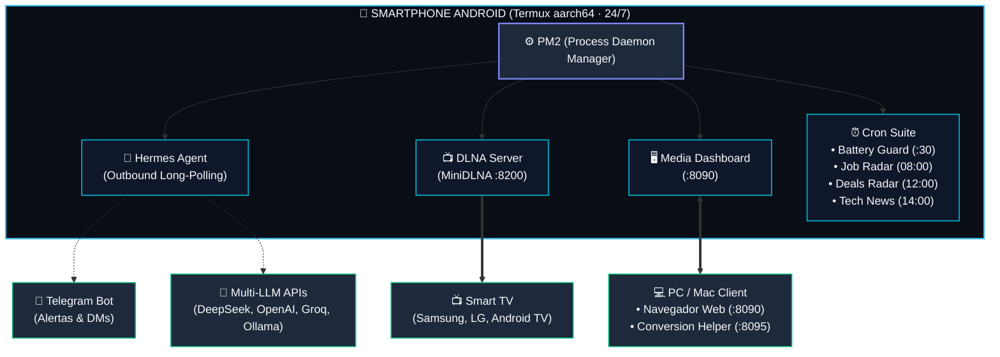

<div align="center">

# 📱 Android Home Server
### Convierte cualquier smartphone viejo en un servidor doméstico 24/7 con IA autónoma, streaming multimedia a tu Smart TV y automatización con crons

[](https://github.com/moisesvalero/android-home-server/stargazers)
[](https://github.com/moisesvalero/android-home-server/network/members)
[](LICENSE)
[](https://f-droid.org)
[](https://www.python.org/)
[](https://nodejs.org/)
[](https://core.telegram.org/bots)
[]()
[]()

<br />

<p align="center">
  <b>¿Tienes un móvil viejo olvidado en un cajón?</b><br />
  No lo tires ni lo dejes acumulando polvo: tienes entre manos una máquina con procesador multinúcleo ARM64, 4 a 8 GB de RAM LPDDR4X, almacenamiento flash ultrarrápido y un <b>SAI / UPS integrado contra cortes de luz</b>.
</p>

[English Overview](#-english-quick-overview) • [Arquitectura](#️-arquitectura-del-sistema) • [Instalación Rápida](#-instalación-rápida-en-3-pasos) • [Batería y Seguridad](#-cuidado-y-seguridad-de-la-batería-la-estrategia-del-50) • [Servidor Multimedia](#-servidor-multimedia-dlna--web-dashboard-8090) • [Crons y LLMs](#-hermes-ai-agent-y-soporte-multi-llm)

</div>

---

## 🏛️ Arquitectura del Sistema

El siguiente diagrama muestra el flujo desacoplado y modular de todos los servicios corriendo sobre **Termux (sin root)** en el smartphone:



---

## 🌟 Características Principales

* 🤖 **Agente de IA Autónomo 24/7 (Hermes Agent):** Asistente inteligente siempre activo y conectado a Telegram mediante *outbound long-polling*. Compatible de forma nativa con **DeepSeek, OpenAI, Groq, OpenRouter o modelos locales vía Ollama** sin necesidad de IP fija ni de abrir puertos en tu router.
* 📺 **Servidor Multimedia DLNA + Web Dashboard:** Streaming directo de películas y series a tu Smart TV con **cero transcodificación en el móvil (~17 MB de RAM y 0% de CPU)**, acompañado de un panel web interactivo en el puerto `8090` con diseño estilo macOS/VisionOS, telemetría del hardware y subidas Drag & Drop.
* 🪄 **El "Botón Mágico" (Conversión sin saturar el móvil):** Si tu televisor (ej. Samsung Tizen) rechaza vídeos `.avi` antiguos de DivX/Xvid por hardware, un micro-asistente silencioso en tu ordenador convierte el archivo con `ffmpeg` nativo por hardware en 1 clic y lo transfiere al servidor ya optimizado.
* ⏰ **Batería de Crons Automatizados:**
  * 💼 **Radar de Empleo:** Rastreo en portales clave (InfoJobs, Indeed, Tecnoempleo, remotos) con memoria histórica persistente (`seen_jobs.json`) para evitar duplicados y curación mediante LLM.
  * 🛒 **Radar de Chollos:** Búsqueda diaria de ofertas reales en tecnología, consolas, hardware y errores de precio.
  * 📰 **Noticias Tech & IA:** Digest matutino con las noticias tecnológicas más destacadas del día.
* 🔋 **Cuidado de Batería (Estrategia del 50%):** Mantiene la química del litio en su punto de reposo más seguro (~3.8V) usando un enchufe temporizador mecánico y un watchdog en Python (`cron_battery_guard.py`) que alerta ante batería baja (<25%) o sobrecalentamiento (≥45°C).
* 📢 **Megafonía Física TTS Doméstica:** Utiliza los altavoces físicos del teléfono como intercomunicador remoto por Telegram (`/di <mensaje>`) a volumen 15/15 con latencia casi nula y 0 tokens consumidos.

---

## ⚡ Comparativa: Móvil Viejo vs Raspberry Pi 4 vs VPS en la Nube

| Característica | VPS Básica (AWS / GCP / Hetzner) | Raspberry Pi 4 (4 GB) | Smartphone Android (6 GB RAM) |
| :--- | :--- | :--- | :--- |
| **Memoria RAM** | 1 GB *(Cuelgues por falta de memoria OOM)* | 4 GB LPDDR4 | **6 GB – 8 GB LPDDR4X** (~3+ GB libres) |
| **Procesador** | 0.25 – 1 vCPU compartida con throttling | 4 núcleos Cortex-A72 | **8 núcleos físicos ARM64** |
| **Almacenamiento**| Disco virtual en red / HDD lento | MicroSD lenta (fácil corrupción) | **Memoria Flash UFS** ultrarrápida |
| **Protección Eléctrica** | N/A ante desastres | Se apaga en seco (corrupción de DB) | **Batería integrada = SAI / UPS nativo** |
| **Coste** | 5 € - 10 € al mes (60-120 €/año) | 80 € - 110 € con accesorios | **0 € (Hardware amortizado en casa)** |
| **Consumo Eléctrico**| Facturado externamente | ~5W a 8W | **~1W a 3W (prácticamente cero)** |

---

## 🔋 Cuidado y Seguridad de la Batería: La Estrategia del 50%

> [!IMPORTANT]
> **Nunca dejes una batería de iones de litio conectada al cargador al 100% las 24 horas del día.** La tensión continua sobre la celda degrada el electrolito y provoca hinchazón física con el tiempo.

Para garantizar máxima longevidad y seguridad contra sobrecalentamiento:

```text
 ┌──────────────────────┐        ┌──────────────────────┐        ┌──────────────────────┐
 │  Enchufe Temporizador│        │  Carga Intermitente  │        │   Batería Saludable  │
 │  (Mecánico / Smart)  │ ────►  │  30 min dos veces    │ ────►  │  Oscila entre 45%    │
 │   Menos de 5 euros   │        │     al día           │        │   y 70% (~3.8V)      │
 └──────────────────────┘        └──────────────────────┘        └──────────────────────┘
```

1. **Voltaje de Reposo Electroquímico:** A ~3.8V por celda (entre el 45% y el 65% de carga), el litio no sufre tensión química destructiva.
2. **Temporizador de Enchufe:** Un programador mecánico de 4 € activa el cargador únicamente **30 a 45 minutos dos veces al día** (ej. 08:00–08:45 y 20:00–20:45). El resto de la jornada el móvil opera con su batería interna.
3. **Watchdog Térmico en Python (`cron_battery_guard.py`):** Consulta `termux-battery-status` cada 30 minutos:
   * **Batería < 25%:** Emite alerta urgente por Telegram si falló el enchufe o se desconectó el cable.
   * **Temperatura ≥ 45°C:** Alerta crítica inmediata para retirar el cargador o mejorar la ventilación.

---

## 🚀 Instalación Rápida en 3 Pasos

### 1. Prepara Termux en el móvil Android
1. Instala **Termux** y **Termux:API** desde [F-Droid](https://f-droid.org) (evita Google Play, ya que está desactualizado).
2. En los ajustes de Android, exime a Termux del ahorro de batería (*Ajustes → Aplicaciones → Termux → Batería → "Sin restricciones"*).

### 2. Clona el repositorio y configura variables
Abre Termux y ejecuta:

```bash
pkg update -y && pkg install -y git
git clone https://github.com/moisesvalero/android-home-server.git ~/.hermes-server
cd ~/.hermes-server

# Copia la plantilla y rellena tus claves
cp .env.example .env
nano .env
```

### 3. Ejecuta el instalador automático
```bash
chmod +x install.sh
./install.sh
```

El script configurará automáticamente:
* Dependencias nativas C/Rust, Python 3 y Node.js.
* MiniDLNA y las carpetas de medios en `~/media/peliculas` y `~/media/series`.
* Gestor de procesos **PM2** con auto-arranque en `~/.termux/boot/start-services.sh`.

---

## 🎬 Servidor Multimedia DLNA & Web Dashboard (`:8090`)

Abre desde el navegador de tu ordenador o tablet en la misma red Wi-Fi:

👉 **`http://<IP-DE-TU-MOVIL>:8090`**

* **Bento Telemetry Card:** Muestra en vivo la temperatura del procesador con código de color, pulso del sistema, nivel de batería, memoria RAM y gigas libres de almacenamiento flash UFS.
* **Cola de Subidas Drag & Drop:** Suelta decenas de vídeos a la vez con subida concurrente y streaming a disco por bloques de 64 KB con limpieza de parciales si se interrumpe la red.
* **Carátulas HD Automáticas (`fetch_cover.py`):** Rastrea las APIs de IMDb y TVMaze para asociar el póster oficial en alta definición a cada película o capítulo.
* **Streaming a la Smart TV:** Pulsa **Fuentes** (o *Dispositivos Conectados*) en el mando de tu televisión y selecciona **Android Media Server**.

---

## 🤖 Hermes AI Agent y Soporte Multi-LLM

Configura en tu archivo `.env` el proveedor de lenguaje que prefieras:

```bash
DEFAULT_LLM_PROVIDER="deepseek"       # deepseek | openai | groq | openrouter | ollama
DEFAULT_LLM_MODEL="deepseek-flash"
```

* **DeepSeek:** `deepseek-flash`, `deepseek-chat`, `deepseek-reasoner` (económico, rápido y excelente en español).
* **OpenAI:** `gpt-4o`, `gpt-4o-mini`.
* **Groq:** Inferencia ultrarrápida en milisegundos con `llama-3.3-70b-versatile`.
* **OpenRouter:** Acceso unificado a cientos de modelos comerciales y abiertos.
* **Ollama / Local:** Modelos locales en tu PC en la red local (`http://192.168.1.X:11434/v1`).

---

## 🛠️ Comandos Útiles (PM2)

```bash
# Ver estado, consumo de memoria y CPU en tiempo real
pm2 status

# Inspeccionar logs en vivo
pm2 logs hermes           # Logs del agente de IA
pm2 logs media-dashboard  # Logs de subidas y panel web
pm2 logs dlna-server      # Logs del servidor DLNA

# Reiniciar todos los servicios
pm2 restart all

# Guardar la lista activa para auto-arranque tras reinicio
pm2 save
```

---

## 🔒 Hardening de Seguridad SSH

Para administrar el móvil de forma remota sin cables desde tu terminal:

1. Añade tu clave pública a `~/.ssh/authorized_keys`.
2. Edita `$PREFIX/etc/ssh/sshd_config`:
   ```text
   PasswordAuthentication no
   PubkeyAuthentication yes
   PermitEmptyPasswords no
   MaxAuthTries 3
   ```
3. Reinicia SSH: `pkill sshd && sshd`.
4. **Seguridad de red:** Nunca abras el puerto `8022` hacia Internet en tu router. El acceso debe quedar restringido a la red Wi-Fi local o realizarse mediante una VPN segura como Tailscale o WireGuard.

---

## 🌐 English Quick Overview

**Android Home Server** is an open-source lightweight server stack running on any spare Android phone via **Termux (no root required)**:
- **Autonomous AI Agent:** Powered by Hermes Agent & Telegram bot (works with DeepSeek, OpenAI, Groq, or local Ollama).
- **Zero-CPU Media Streaming:** MiniDLNA streams directly to Smart TVs (Samsung Tizen, LG webOS, Android TV) at 0% CPU and ~17 MB RAM, with an interactive web dashboard on port `8090`.
- **Automated Crons:** Deduplicated daily job board scraper, tech deals radar, and news digest.
- **Built-in UPS & Battery Safety:** Battery keeps the server alive during power outages. Mechanical timer cycles charging (45%-70%) to prevent battery degradation, backed by a thermal watchdog script.
- **0 € / Month:** 100% self-hosted, consumes just 1-3W.

---

## ⭐ ¿Te ha resultado útil?

Si este proyecto te ha servido de inspiración para darle una segunda vida a tu móvil viejo o te ha ahorrado una cuota mensual en la nube:

⭐ **¡Deja una estrella en el repositorio para apoyar el proyecto y que más personas lo descubran!** ⭐

---

## 📄 Licencia

Este proyecto está liberado bajo la licencia de código abierto **[MIT](LICENSE)**. Siéntete libre de clonarlo, adaptarlo y compartirlo.
